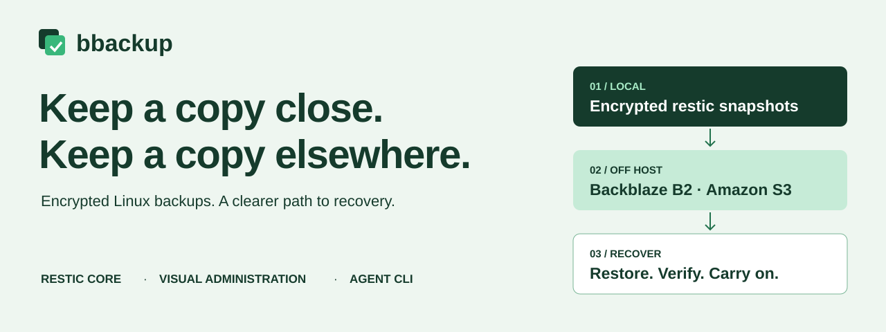

# bbackup

**Local-first, encrypted backup and restore for Linux servers.** Capture to a nearby repository, replicate selected snapshots to independent storage, and restore into a new directory.

[](https://www.python.org/downloads/) [](LICENSE) [](CHANGELOG.md)

[Quick start](QUICKSTART.md) · [Install](INSTALL.md) · [Cloud storage](docs/cloud-storage.md) · [Agent CLI](docs/AGENT_INTEGRATION.md) · [All documentation](docs/README.md)



> [!WARNING]
> Version 2.0.0-alpha.1 is a pre-release preview, not a production-qualified backup system. Keep another recovery path and test against disposable data before using it.

## Keep recovery close and independent

- **Recover quickly from local storage.** Restore from a nearby encrypted repository without waiting for a cloud download.
- **Keep an independent replica.** Copy successful snapshots to Backblaze B2 or Amazon S3, with a separate password for each repository.
- **Protect mixed Linux workloads.** Capture file trees and database sources through named jobs.
- **Choose mouse or automation.** Use the [Textual dashboard preview](docs/assets/bbackup-dashboard-preview.svg) or strict, schema-discoverable JSON commands.

## Preview status

Version 2 is still exposed under `bbackup production`; the legacy 1.x commands remain available. The Ubuntu 24.04 and 26.04 AMD64 and ARM64 systems are target platforms, not yet qualified package releases.

Local restic and Garage S3-compatible capture, copy, check, and restore cycles have passed. Native database live qualification, B2/AWS provider recovery and thirty-day protection, Ubuntu packages, and production readiness remain unqualified. See the [v2 preview and current release evidence](docs/development/version-2.md).

## Install the preview

Install the prerelease from its pinned source tag:

```bash
uv tool install --force 'git+https://github.com/CruxExperts/best-backup.git@v2.0.0-alpha.1'
```

For the retained 1.x command line, install the `v1.8.6` release tag:

```bash
uv tool install --force 'git+https://github.com/CruxExperts/best-backup.git@v1.8.6'
```

See [INSTALL.md](INSTALL.md) for prerequisites and development setup. The v2 preview requires Python 3.12+ and `restic`; Docker, `rsync`, and `tar` are only needed by the retained 1.x Docker/filesystem workflow. Database capture and restore also require the matching native database clients.

## First v2 capture

Create strict portable policy and private host bindings as described in the [quick start](QUICKSTART.md), then run:

```bash
bbackup production --config config.json --bindings bindings.json doctor
bbackup production --config config.json --bindings bindings.json jobs run --name daily
```

`jobs run` captures locally and copies the successful snapshot to each configured replica. Keep the returned full snapshot IDs. The quick start shows how to verify a repository and restore a selected ID into a new directory.

## Cloud destinations

Backblaze B2 through its S3 API and Amazon S3 can be configured as restic repositories and restore sources. The preview also has a native read-only B2 capability inspection path. Provider-specific thirty-day retention and independent recovery qualification are still pending; setup details and exact boundaries are in the [cloud storage guide](docs/cloud-storage.md).

## Choose a guide

- [Quick start](QUICKSTART.md): v2 configuration, password files, local capture, replicas, and restore.
- [Installation](INSTALL.md): pinned source installs, legacy release, and development checkout.
- [Agent integration](docs/AGENT_INTEGRATION.md): strict schemas, JSON envelopes, pagination, and reconciliation.
- [Cloud storage](docs/cloud-storage.md): B2/S3 repository setup and provider qualification limits.
- [Legacy management](docs/management.md): retained `bbman` and 1.x commands.
- [Encryption](docs/encryption.md): restic password custody and legacy file-encryption modes.
- [Architecture](docs/architecture.md): preview service boundary and retained implementation.
- [Support](SUPPORT.md) · [Security](SECURITY.md) · [Contributing](CONTRIBUTING.md)

## License

[MIT](LICENSE)

<!-- project-footer:start -->

<br><br>

<p align="center">
Slavic Kozyuk<br>
&copy; 2026 <a href="https://www.cruxexperts.com/">Crux Experts LLC</a> &mdash; <a href="https://github.com/CruxExperts/best-backup/blob/main/LICENSE">MIT License</a>
</p>

<!-- project-footer:end -->
