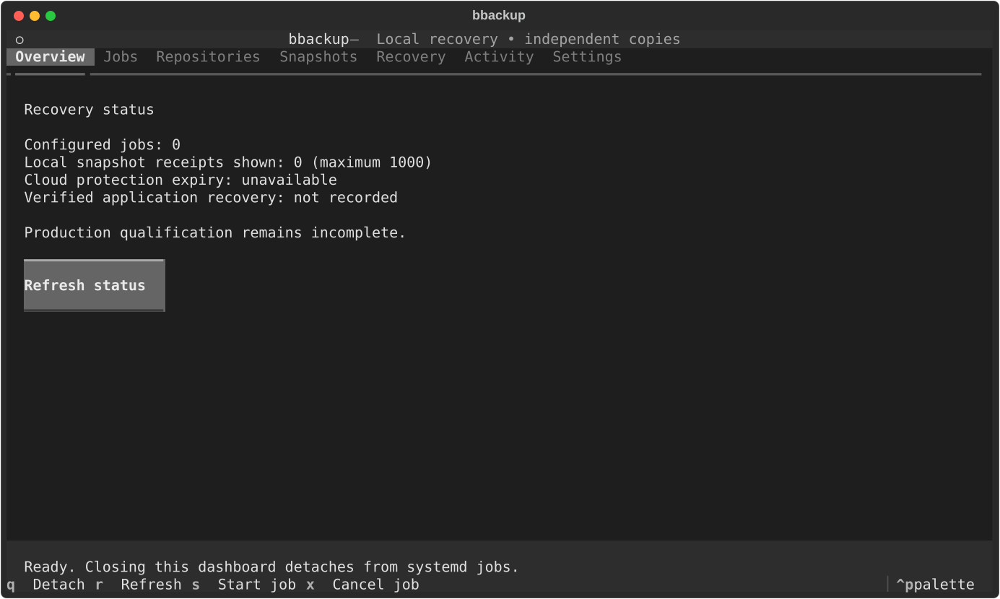

# Version 2 development

> Status: 2.0.0-alpha.1 prerelease. Production qualification is in progress.

## Direction and delivery order

The target is a restic-centered backup and recovery product for independent
Ubuntu 24.04 and 26.04 hosts on AMD64 and ARM64. Daily local encrypted capture
precedes replication into an independently encrypted B2 or AWS S3 repository.
The CLI and Textual dashboard share one operations service. Existing 1.x commands
remain available during development; the preview is exposed under
`bbackup production` until replacement capabilities and release evidence exist.

Delivery proceeds through core/configuration, capture/restore, cloud protection
and independent escrow, CLI/TUI, then packages/documentation/release qualification.
A preview capability does not establish completion of its entire delivery slice.

## Implemented preview

- Strict version-2 JSON configuration rejects duplicate keys, unknown fields,
  unsupported source types, and inconsistent repository references. Private host
  bindings and password files are separate from portable policy.
- Typed operation plans, bounded process output, timeouts, process-group
  cancellation, sanitized SQLite lifecycle records, and repository locks provide
  a shared execution boundary. Interrupted mutations remain uncertain; they are
  never automatically replayed. Receipts commit before operations finish.
- File trees go directly to restic. SQLite databases use the backup API and a
  private temporary export; uncommitted writes are excluded. PostgreSQL streams
  custom-format native exports; MySQL/MariaDB require an explicit read-lock policy.
  Native database adapters have fixture coverage only. Live file trees are
  best-effort captures, not atomic filesystem snapshots.
- Local capture records complete successful snapshot IDs. Copies use independent
  passwords and matching chunking parameters, then verify the destination identity.
  A failed or incomplete capture is not eligible for replication.
- Restore requires a new directory outside source paths, repositories, credentials,
  and runtime state, and asks restic to verify restored files. This does not prove
  application startup or database recovery.
- The preview CLI emits a version-2 JSON envelope, accepts strict JSON or flags,
  rejects duplicate inputs, and exposes bounded pagination. The Textual dashboard
  supports mouse/keyboard job selection, search, table sorting, and systemd start
  and cancel requests. Closing the dashboard detaches from installed jobs.
- Generated systemd timers use daily scheduling and persistent missed-run handling.
  Rendering does not install or enable units.



## Trying the preview

Use a disposable local directory and private password files. Keep state and
repositories outside every source tree. The following paths are examples, not
installed defaults.

Portable configuration (`config.json`):

```json
{
  "schema_version": 2,
  "repositories": [
    {"name": "local", "role": "local"},
    {"name": "replica", "role": "replica"}
  ],
  "sources": [
    {"name": "documents", "kind": "files", "paths": ["/srv/documents"]}
  ],
  "jobs": [
    {"name": "daily", "repository": "local", "sources": ["documents"], "replicas": ["replica"]}
  ]
}
```

Private host bindings (`bindings.json`, mode 0600):

```json
{
  "schema_version": 2,
  "state_dir": "/var/lib/bbackup",
  "repositories": {
    "local": {"repository": "/srv/backup-local", "password_file": "/etc/bbackup/local.password"},
    "replica": {"repository": "/srv/backup-replica", "password_file": "/etc/bbackup/replica.password"}
  }
}
```

Create password files yourself with independent passwords and mode 0600. They
must be available without interactive prompts. State must have mode 0700.
An S3 binding can use restic's `s3:https://ENDPOINT/BUCKET/PREFIX` syntax;
provider credentials belong in the supervised process environment, never in JSON
policy or repository URLs.

```bash
bbackup production --config config.json --bindings bindings.json doctor
bbackup production --config config.json --bindings bindings.json repositories init --name local
bbackup production --config config.json --bindings bindings.json repositories init --name replica --source local
bbackup production --config config.json --bindings bindings.json jobs run --name daily
bbackup production --config config.json --bindings bindings.json repositories check --name replica
bbackup production --config config.json --bindings bindings.json snapshots list --limit 100
bbackup production --config config.json --bindings bindings.json tui
```

Use the exact destination snapshot ID from the copy result for restore:

```bash
bbackup production --config config.json --bindings bindings.json restore \
  --repository replica --snapshot FULL_DESTINATION_SNAPSHOT_ID --target /srv/new-restore
```

Every registered operation provides `--schema`. The generated
[command reference](../production-cli.md) and packaged
`bbackup/data/production-schemas.json` come from `bbackup/cli_metadata.py` through
`scripts/generate_cli_skills.py`. Exit 2 indicates invalid input, exit 3 an
operational failure. Production command syntax errors use the same sanitized envelope. `runs stream` explicitly emits bounded JSON-lines lifecycle events. Raw subprocess errors
and commands are not included in the public envelope.

## Operational limits

Use one shared state directory for all bbackup writers for a repository. The
local ledger lock cannot coordinate an independently invoked restic process or
another host using a different ledger. Restic provides its own repository locks,
but independent recovery checkpoints additionally need a coordinated quiescent
window across all writers.

The preview intentionally has no automatic deletion. Seven local daily snapshots
and thirty cloud daily, eight weekly, twelve monthly snapshots are policy defaults,
not an implemented pruning schedule. Local capture stops on a minimum-space
check or restic failure; it does not reclaim pending recovery points. The fixed
64 MiB preflight threshold is not a capacity forecast. Capture may still run out
of space, in which case no successful receipt is written.

Uncertain operations require administrator reconciliation against repository
state and the recorded capture operation tag. Do not clear the ledger or remove
restic locks to make a retry proceed. `runs reconcile` records an explicitly administrator-reviewed outcome without
replaying the command. Review the repository first; the command does not
synthesize missing snapshot receipts or remove repository locks. Failed restore output is retained for inspection; empty targets
from a refused dispatch are removed when possible.

## Native database capture preview

PostgreSQL sources use `kind: "postgresql"`, a safe `database` name, and a
`connection` reference instead of `paths`. The corresponding private
`database_bindings` entry contains `kind`, an absolute `service_file`, a
`service_name`, and optionally an absolute `password_file`. The service and
password files must be private regular files. Native output must have the
PostgreSQL custom-archive signature before it becomes eligible for backup.

MySQL and MariaDB sources use `kind: "mysql"` or `"mariadb"`, `database`,
`connection`, and explicitly `quiesce: "read-lock"`. Their private binding uses
matching `kind` and an absolute `options_file`. The preview refuses non-InnoDB
tables and uses a native global read lock for the dump, blocking writes while it
runs. This explicit policy prevents concurrent schema changes from invalidating
the export. It requires the database account's corresponding lock privileges;
it is not a zero-interruption capture mode. MySQL login-path overrides are disabled.

Native database clients must be installed separately on the capture and restore
hosts. New database captures include a versioned manifest inside the snapshot.
PostgreSQL restore uses that snapshot-time manifest, so the original source
configuration and ledger are not required. Select a destination connection from
private host bindings and a new database name:

```bash
bbackup production --config config.json --bindings bindings.json databases restore \
  --repository replica --snapshot FULL_DESTINATION_SNAPSHOT_ID \
  --source DATABASE_SOURCE_NAME --connection RECOVERY_CONNECTION \
  --target-database recovered_app --trusted-archive
```

This preview requires PostgreSQL 15 or newer and libc locale databases. Capture
records the source encoding, collation, and character classification; restore
creates the destination from the pristine `template0` with those exact settings.
The matching locales must be installed on the destination server. ICU and other
locale providers are refused until their version-specific metadata is supported.

The archive must come from a trusted source: database restores execute archived
SQL. The command refuses existing databases, stops on restore errors, and checks
read-only connectivity afterward. It never drops a database, and an interrupted
restore retains the partial destination for inspection. Use `databases reconcile`
only after inspecting that destination. Coordinate all writers through one state
directory and one destination binding; differently named service aliases are not
proof of different servers. Connectivity success does not establish application
startup or application-specific data correctness.

MySQL/MariaDB native restore is not exposed yet. Do not replay a SQL dump into
an existing production database. Native capture and restore qualification under
concurrent source writes remains a release gate; executable fixtures validate
command orchestration, failure handling, and credential isolation only.

## Independent recovery artifacts

The cloud adapter streams exact current versions and delete markers into a
signed, GnuPG-encrypted checkpoint kit containing an independent restic password.
The signed inventory binds the storage endpoint, bucket, prefix, repository ID,
and complete snapshot ID. Recovery requires the exact trusted OpenPGP fingerprint;
revoked, expired, invalid, and unverifiable signatures are refused. Keep the
signing and decryption keys independently accessible and renew checkpoints before
key expiry. No key is generated or imported by the product.

`recovery checkpoint` first runs a full restic check and verifies repository and
snapshot identity under the local operation lease. An administrator must also
coordinate a quiescent window across every external writer. It rejects missing
versioning, current-object expiration, and noncurrent expiration under thirty
days. An observed lifecycle policy does not prove backup credential restrictions
or provider behavior, so the preview never returns a production protection claim.

`recovery open` authenticates a kit into a new private directory. It works without
the original host configuration or ledger. `recovery restore` authenticates the
checkpoint and downloads its exact historical object versions into an empty
local repository, leaving the damaged source untouched. Transient restic locks
are excluded, delete markers remain absent, and failures leave partial output
for inspection. Expired checkpoints permit best-effort recovery with expiry
reported. `recovery restore` also requires the independent password file, verifies the
rebuilt repository identity, runs a full-data restic check, and confirms the
requested snapshot exists. An application recovery drill remains necessary.

Review the generated [recovery command schemas](../production-cli.md) before
running these administrator operations. Keep kits outside the protected host;
creating a kit on that host does not establish independent custody.

## Qualification and remaining work

The signed [2.0.0-alpha.1 prerelease](https://github.com/CruxExperts/BestBackup/releases/tag/v2.0.0-alpha.1) was published on October 3, 2026 from commit `b10ed84`. GitHub CI passed on Python 3.12, 3.13, and 3.14, and the release workflow built and smoke-tested its wheel and source archive. `SHA256SUMS` and its OpenPGP signature cover the exact downloadable artifacts. The release remains explicitly marked as a prerelease; it does not establish production qualification.

On October 3, 2026, the combined checkout passed 753 tests with eight workers,
including native-client fixtures and a real restic snapshot-manifest round trip
without the original source configuration or ledger. The built wheel passed an isolated installation smoke
test using hash-locked dependencies, including version-2 schema discovery.
Source compilation, focused lint, generated CLI/schema checks, version alignment,
Markdown standards, and diff whitespace checks also passed. These checks include
the preserved pre-existing working-tree changes; they are not release acceptance
for Ubuntu packages or cloud protection.

A quota-limited local Garage S3 test also passed capture, copy, full-data check,
and verified restore with independent passwords. Its private bucket and
password record are retained outside Git for follow-up. Garage is not qualified
for the thirty-day cloud protection claim.

Local tests cover independent repository initialization, capture, explicit copy,
full-data check, and verified file restore including modes and symbolic links.
SQLite tests cover capture while a writer holds uncommitted changes. Subprocess
tests exercise bounded output, cancellation, timeout and process-group cleanup;
ledger tests exercise contention, interruption, privacy and pagination. Headless
Textual tests exercise mouse tabs, keyboard selection, search and terminal resize.

The release still requires live PostgreSQL capture/restore and MySQL/MariaDB capture
qualification, safe MySQL/MariaDB native restore, Docker quiescence/restart recovery, application validation,
independent recovery kit qualification, protected cloud retention and historical-version
recovery qualification, complete setup/restore/settings interfaces, live progress,
and versioned Ubuntu packaging with installed upgrade/rollback tests.
No legacy implementation has been removed before its replacement is ready.

B2/AWS restricted-credential tests, thirty-day expiry boundaries, aged deduplicated
packs, overwritten metadata, delete markers, pruning, reboot/interrupted upgrades,
million-file runs, and representative 1–10 TB exercises remain release gates.
Linux Mint local testing and Garage S3-compatible testing do not qualify these
provider or platform claims. Restore deadlines must come from measured drills.

## Dependency evidence

The optional Google Drive client uses oauthlib 4.0.0 to incorporate upstream
fixes for CVE-2026-49264 and CVE-2026-49265. Exact-version OSV, GitHub advisory,
deps.dev, and PyPI checks found no affecting advisories; neither CVE appeared in
the CISA exploitation catalog at review time. Client compatibility was verified
offline without authorizing an account. These findings concern optional legacy
Google Drive support and do not change the B2/S3 storage workflow.

Native B2 inspection uses Backblaze b2sdk 2.13.0, the latest stable SDK checked
for the Python 3.12+ baseline on October 3, 2026. Its new dependencies are
annotated-types 0.8.0 and logfury 1.0.1. Exact resolved SDK and HTTP dependency
versions were checked against OSV, GitHub advisories, deps.dev, and PyPI; no
affecting advisories were returned. SDK retry behavior is bounded by the native
inspection subprocess deadline and cancellation. Throttling and transient-error
backoff tests passed. See [cloud storage](../cloud-storage.md) for the connection
and recovery boundaries.


Textual 8.2.8 and its newly resolved dependencies, and boto3 1.43.108 with its
resolved dependency closure, were checked against OSV, GitHub advisories and
PyPI metadata on October 3, 2026. Those exact selected versions had no matching
advisories in the queries. This is not a permanent safety guarantee or a complete
release supply-chain audit. urllib3 was moved from 2.7.0 to 2.8.0 to address the
[maintainer's disclosed fixes](https://github.com/urllib3/urllib3/releases/tag/2.8.0).
The lockfile owns exact versions and package hashes.

<!-- project-footer:start -->

<br><br>

<p align="center">
Slavic Kozyuk<br>
&copy; 2026 <a href="https://www.cruxexperts.com/">Crux Experts LLC</a> &mdash; <a href="https://github.com/CruxExperts/best-backup/blob/main/LICENSE">MIT License</a>
</p>

<!-- project-footer:end -->
